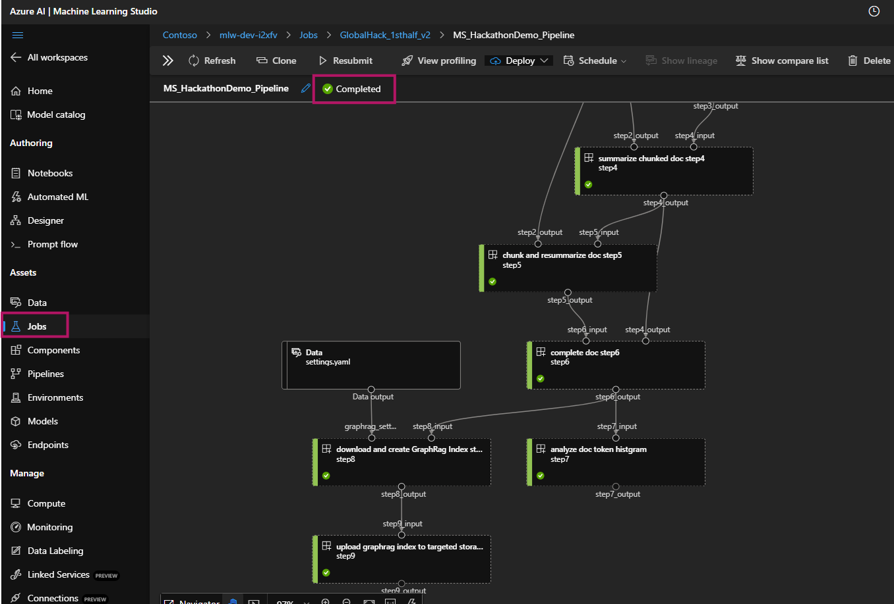

# 🎉 GraphRAG-Index-SimpleBuilder: Indexing by Azure Machine Learning 🎉

```mermaid
---
config:
  theme: dark
  look: handDrawn
  layout: dagre
---
flowchart TD
    A[User] --> |azd up| B[Azure Developer CLI]
    B --> |create| C[Azure ML]
    B --> |create| D[Azure BlobStorage]
    subgraph Hook PostProvision
        subgraph Check and Assign Roles
            E[Azure CLI] --> |check role| C
            E --> |assign if no assignment| D
        end
        subgraph Create ML Pipeline
            F[Azure CLI] --> |Manage/Install ML Extension| C[Azure ML]
            F[Azure CLI] --> |trigger PipelineJob| C[Azure ML]
            C --> |Create/Send ML Pipeline Job with configurations| G[ML Pipelines]
            G --> I[Graph RAG
                      Index]
            J[<img src="https://upload.wikimedia.org/wikipedia/commons/9/91/Octicons-mark-github.svg" alt="GitHub" width="30" height="30"/> GitHub]--> |PULL| G
            style J fill:#424242,stroke:#FFEDD5,stroke-width:2px
            I --> |Upload Index| D
            G --> |Schedule| H[Weekly Schedule]
            H --> G

        end
    end
```

## 🚀 Background: What Is This Project About?

Welcome to **GraphRAG-Index-SimpleBuilder**, a project I created for the internal Global Hackathon project!🎨 The aim of this project is to simplify the management and creation of **Azure Machine Learning (AML) Pipelines for building a GraphRAG index**, all through the **Azure Developer CLI**.

This project focuses on the backend functionality without any user interface. It allows users to easily set up and schedule jobs for creating and managing GraphRAG indexes using Azure Developer CLI.

Whether you're looking to automate your ML workflows or streamline your data processes, this tool makes it straightforward! 🙌

## 🔑 Key Features

Here are the main features of this project:

- **✨ Simplified Management**: Manage Azure Machine Learning Pipelines and GraphRAG index creation easily with Azure Developer CLI.
 

- **🤖 Automated Job Scheduling**: Schedule your ML Pipeline jobs automatically, ensuring your GraphRAG index is always up-to-date.
 

- **🛠️ Streamlined Workflow**: Create and manage the complete workflow from AML setup to index creation with minimal steps.
 

- **⚡ Azure Integration**: Leverage Azure services to enhance your machine learning capabilities and data handling.

## 🎯 Deploying with the Azure Developer CLI

Let’s get you up and running! Just follow these simple steps:

> **AZURE RESOURCE COSTS** by default this sample will create Azure App Service and Azure Cognitive Search resources that have a monthly cost, as well as Form Recognizer resource that has cost per document page. You can switch them to free versions of each of them if you want to avoid this cost by changing the parameters file under the infra folder (though there are some limits to consider; for example, you can have up to 1 free Cognitive Search resource per subscription, and the free Form Recognizer resource only analyzes the first 2 pages of each document.)

- Install prerequisites:

    - [Azure Developer CLI](https://aka.ms/azure-dev/install)
    - [Python 3+](https://www.python.org/downloads/)
        - **Important**: Python and the pip package manager must be in the path in Windows for the setup scripts to work.
    - [Git](https://git-scm.com/downloads)
    - [Powershell 7+ (pwsh)](https://github.com/powershell/powershell) - For Windows users only.
    - **Important**: Ensure you can run `pwsh.exe` from a PowerShell command. If this fails, you likely need to upgrade PowerShell.

### Deploy Step:
you can provision all resources from scratch by following these steps:

1. Run `azd auth login` to login to your Azure account.
 

1. Run `azd up` to provision Azure resources and deploy this MLPipeline Architecture to those resources. This also runs a script to execute Pipeline Job based on files in the `./scripts/mlpipeline/` folder.
    * For the target location, the regions that currently support the models used in this sample are **East US2**. For an up-to-date list of regions and models, check [here](https://learn.microsoft.com/en-us/azure/cognitive-services/openai/concepts/models)
 

1. After the application has been successfully deployed you will see a URL printed to the [Azure Machine Learning Studio UI](https://ml.azure.com).  Click that URL to check ML Pipeline JOB Status in your browser.
    > NOTE: It may take ~6 hours for the MLPipeline Job to be fully completed. wait a minute and refresh the page.

👇
*Please click Step9 Component and check the storage resource information that contains the GraphRag Index data.

## 🎮 How to Use the UI with Created GraphRAG Index:

If you want to easily operate the GraphRAG Index created in this GitHub project on the UI, you can refer to [GraphRAG-SimpleUI-Builder Tool](https://github.com/KazuOnuki/GraphRAG-SimpleUI-Builder), or you can use your own custom UI to import and use it for searches!🚀

## 📊 Architecture Overview

Below is the architecture of the project:

```mermaid
---
config:
  theme: dark
  look: handDrawn
  layout: dagre
---
flowchart TD
    A[User] --> |azd up| B[Azure Developer CLI]
    B --> |create| C[Azure ML]
    B --> |create| D[Azure BlobStorage]
    subgraph Hook PostProvision
        subgraph Check and Assign Roles
            E[Azure CLI] --> |check role| C
            E --> |assign if no assignment| D
        end
        subgraph Create ML Pipeline
            F[Azure CLI] --> |Manage/Install ML Extension| C[Azure ML]
            F[Azure CLI] --> |trigger PipelineJob| C[Azure ML]
            C --> |Create/Send ML Pipeline Job with configurations| G[ML Pipelines]
            G --> I[Graph RAG
                      Index]
            J[<img src="https://upload.wikimedia.org/wikipedia/commons/9/91/Octicons-mark-github.svg" alt="GitHub" width="30" height="30"/> GitHub]--> |PULL| G
            style J fill:#424242,stroke:#FFEDD5,stroke-width:2px
            I --> |Upload Index| D
            G --> |Schedule| H[Weekly Schedule]
            H --> G

        end
    end
```

