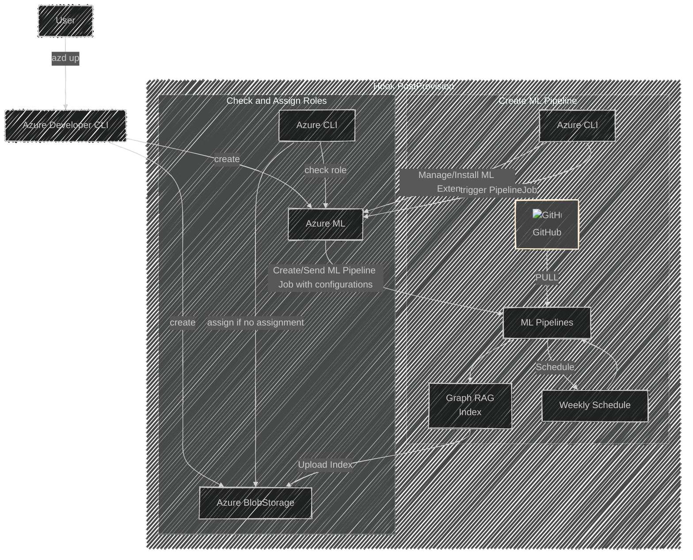

```mermaid
---
config:
  theme: dark
  look: handDrawn
  layout: dagre
---
flowchart TD
    A[User] --> |azd up| B[Azure Developer CLI]
    B --> |create| C[Azure ML]
    B --> |create| D[Azure BlobStorage]
    subgraph Hook PostProvision
        subgraph Check and Assign Roles
            E[Azure CLI] --> |check role| C
            E --> |assign if no assignment| D
        end
        subgraph Create ML Pipeline
            F[Azure CLI] --> |Manage/Install ML Extension| C[Azure ML]
            F[Azure CLI] --> |trigger PipelineJob| C[Azure ML]
            C --> |Create/Send ML Pipeline Job with configurations| G[ML Pipelines]
            G --> I[Graph RAG
                      Index]
            J[<img src="https://upload.wikimedia.org/wikipedia/commons/9/91/Octicons-mark-github.svg" alt="GitHub" width="30" height="30"/> GitHub]--> |PULL| G
            style J fill:#424242,stroke:#FFEDD5,stroke-width:2px
            I --> |Upload Index| D
            G --> |Schedule| H[Weekly Schedule]
            H --> G

        end
    end
```
